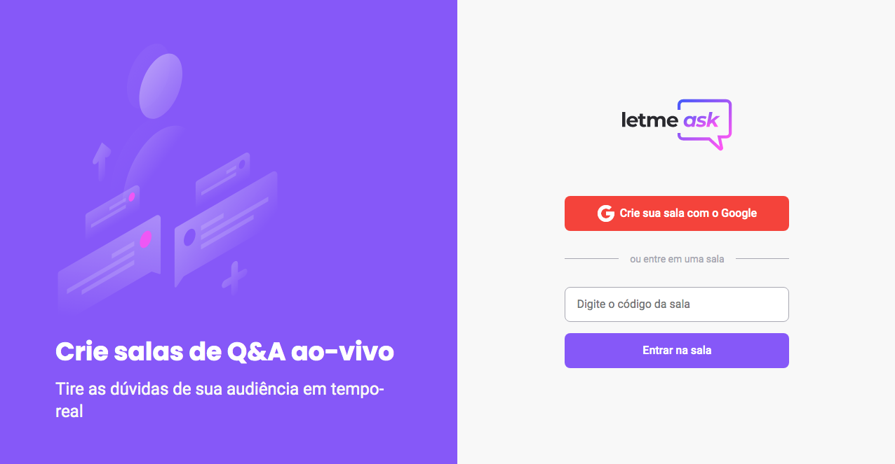

<h1 align="center">
  Let me ask
</h1>

  

 

  

## About

Live question and answers system developed with `React`, `Typescript` and `Firebase`

## Init

`npm install`

`npm start`

Configure `.env.local` with Firebase credentials

## Deploy

`npm build`

`firebase deploy`

Needs to have `.env.local` configured

## Hosting

Hosted on: https://letmeask-5ca87.web.app